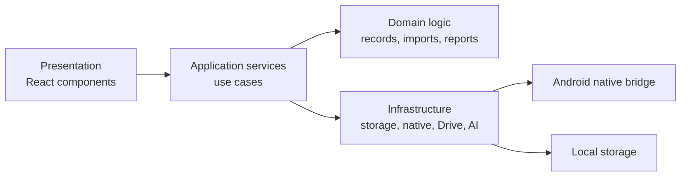

# Architecture

## Product Shape

The system is a hybrid product:

- Android app: primary product for Takeout import, YouTube share capture, local storage, daily review, reports, and reminders.
- Web/Vercel: landing page, guide, demo, privacy explanation, and optional shared reports.

The app should remain YouTube-first until the daily loop and paid-value loop are validated.

## Layers



## Layer Responsibilities

Presentation:

- Screen layout, mobile interaction, loading states, selected tabs, and user-triggered actions.
- Should not parse Takeout files, deduplicate records, classify videos, or build reports directly.

Application:

- Coordinates use cases such as importing a ZIP, saving a shared YouTube link, building a daily review, and generating a weekly report.
- Converts infrastructure results into UI-friendly state.

Domain:

- Pure rules and data transformations.
- Includes date grouping, record identity, deduplication, classification, summary building, timeline grouping, and report building.

Infrastructure:

- Browser file APIs, IndexedDB/local storage, Android native bridge, Google Drive selection, AI provider calls, and export/download behavior.

## Core Domain Types

- `WatchRecord`: one viewing event, not just one video.
- `VideoMemory`: a saved video plus user memory metadata such as note, tag, and review status.
- `ImportBatch`: one import attempt and its outcome.
- `ImportSource`: Takeout ZIP, native Drive file, shared URL, or manual entry.
- `DailyDigest`: one date's record distribution, timeline, and review prompts.
- `WeeklyDigest`: weekly patterns, category movement, channel movement, and recall candidates.
- `JournalEntry`: user-authored reflection attached to a date or video.
- `VideoInsight`: optional AI or rule-based summary attached to a video.

## Importer Contract

Importers must expose the same conceptual behavior:

```ts
export type ImportProgress = {
  phase: "selecting" | "copying" | "scanning" | "parsing" | "merging" | "complete" | "error";
  percent?: number;
  detail?: string;
};

export type ImportResult = {
  sourceLabel: string;
  totalParsed: number;
  addedCount: number;
  duplicateCount: number;
  failedCount: number;
};

export interface WatchRecordImporter<TSource> {
  import(source: TSource, onProgress?: (progress: ImportProgress) => void): Promise<ImportResult>;
}
```

Current and future implementations:

- `TakeoutZipImporter`: browser-selected local ZIP.
- `NativeDriveTakeoutImporter`: Android file picker and native ZIP scanning.
- `SharedUrlImporter`: Android share intent from YouTube.
- `ManualVideoImporter`: optional manual URL entry.

## Insight Provider Contract

AI behavior must be optional and replaceable.

```ts
export interface VideoInsightProvider {
  summarizeVideo(input: VideoInsightInput): Promise<VideoInsight>;
  summarizeDay(input: DailyDigest): Promise<DailyInsight>;
  summarizeWeek(input: WeeklyDigest): Promise<WeeklyInsight>;
}
```

Implementations:

- `NoopInsightProvider`: no AI, returns empty insight.
- `KeywordInsightProvider`: local rule-based summary.
- `RemoteAiInsightProvider`: paid or credit-limited AI.
- `LocalModelInsightProvider`: future self-hosted model.

## Important Boundaries

- Do not couple React Flow mind-map code to import or storage logic.
- Do not couple Google Drive access to Takeout parsing.
- Do not couple AI insight generation to persistence. Generate, review, then persist.
- Do not use broad Drive search as the default import path.
